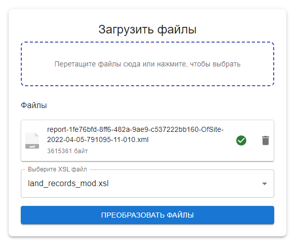

# KPT2CAD

## Запуск backend
<b>Важно!</b>
На текущий момент docker поддерживается только backend-частью
1. Соберите Docker образ:

   ```docker
   docker build -t app .
   ```

2. Запустите контейнер:

   ```docker
   docker run -d --name app-container -p 8080:8080 app
   ```

## Запуск frontend
<b>TBD</b>

На данный момент можно воспользоваться примером конфигурации nginx из репозитория.

## Порты (внутренние)

- **API**: `8080`
- **Frontend**: `3000`

## Внешний вид веб-панели

